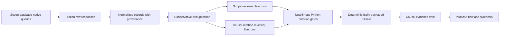

# Causal Multi-omics Aging Review

Reproducible PRISMA-oriented pipeline for identifying empirical multi-omics
studies that investigate aging processes and contain an assessable causal
design or directed causal hypothesis.

The repository is a clean aging-specific rebuild. It reuses only the general
pipeline architecture of
[`BogdanDidenko/text-bio-fundational-models-review`](https://github.com/BogdanDidenko/text-bio-fundational-models-review)
and `BogdanDidenko/causal-multiomics-review`: database-native retrieval,
conservative deduplication, criterion-level LLM screening, deterministic
Python gates, selective adjudication, repeated runs, and an audit trail. It
does not contain the earlier non-aging queries, corpora, benchmarks, prompt
history, or run outputs.

## Review Question

Which empirical studies integrate at least two molecular omics layers to
investigate a process or phenotype of aging, and what causal claim or
identification strategy do they support?

The search does not require the exact phrases `causal inference` or `causal
discovery`. Its causal block includes genetic instruments, mediation,
interventions, perturbations, quasi-experiments, temporal designs, and directed
models. Eligibility is decided from the reported design, not keyword presence.

## v1 Status

`v1.0.0` is the current calibration candidate. It replaces the rejected
`v0.99.0` title/abstract instrument, which measured reproducibility without an
expert gold standard and incorrectly allowed directional wording to create a
causal candidate. The old prompts, 790 outcomes, and 9,515 raw responses remain
unchanged as development history; they are not part of the v1 ledger or final
PRISMA denominator.

The v1 search count pilot has run, but the queries are not frozen. Expert query
QA, at least 100 two-expert-adjudicated canonical positives, benchmark
annotation, and model validation remain required before production screening.
An algorithmically prioritized 120-record candidate pool is available for this
review. Repeated Terra Medium screening plus assistant adjudication yielded 95
include, 23 exclude, and two seek-full-text labels, but only 71.7% exact
all-tracked-field agreement. The run is an audited calibration result, not a
gold standard, and the suite does not pass its 100% stability gate.

## Pipeline



## Quick Start

```bash
python -m venv .venv
source .venv/bin/activate
python -m pip install -e '.[dev]'
python scripts/validate_protocol.py
python scripts/validate_protocol_v1.py
pytest
```

Run a fresh database search. Credentials are read from environment variables
or the existing macOS Keychain entries and are never written to the repository.

```bash
python scripts/search_databases.py \
  --search-config protocol/search_config_v1.1.2.json \
  --output data/searches/pilots/2026-08-02-v1.1.2 \
  --max-records-per-source 50 \
  --sample-seed 20260802
```

The `v1.1.2` default excludes Springer Nature from identification because the
available Meta API searches a broad full-text index. OpenAlex runs six scoped
query branches, uses exact aging-term matching, and deduplicates their Work IDs
locally. For OpenAlex, the pilot record cap applies separately to each branch.
The fixed sample seed creates a reproducible random branch-quality sample;
omitting `--sample-seed` retains deterministic citation-count ordering.

Google Scholar is a documented manual supplementary search because it has no
official API. After freezing the browser export, normalize it and build the
identification snapshot:

```bash
python scripts/import_google_scholar.py \
  --output data/searches/2026-07-27
python scripts/deduplicate.py \
  data/searches/2026-07-27/normalized/all_sources.csv \
  data/normalized/canonical.csv \
  --log data/normalized/deduplication_log.csv
python scripts/summarize_search.py \
  --search-dir data/searches/2026-07-27 \
  --canonical data/normalized/canonical.csv \
  --report docs/search_execution_2026-07-27.md
```

The frozen 2026-07-27 run is a superseded pilot and is not a final PRISMA
denominator. The v1 count/quality pilot and unresolved gates are documented in
[`docs/search_calibration_v1.0.0.md`](docs/search_calibration_v1.0.0.md).
The current OpenAlex scope ablation and complete retrieval are documented in
[`analysis/openalex_scope_calibration/report.md`](analysis/openalex_scope_calibration/report.md).

After expert-gold development annotation, run the v1 suite with GPT 5.6 Terra
Medium through the locally authenticated Codex CLI:

```bash
python scripts/run_stability.py \
  protocol/screening/benchmarks/v1.0.0/title_abstract_development_80.csv \
  data/screening/stability/v1-development \
  --stage title_abstract \
  --suite-config protocol/screening/configs/prompt_suite_v1.0.0.json \
  --parallel-replicates 5
```

Acceptance requires both 100% five-run agreement on decision-driving fields
and the prespecified expert-gold accuracy thresholds. The v1 protocol and
postmortem are in [`protocol/v1.0.0/prisma_pipeline.md`](protocol/v1.0.0/prisma_pipeline.md)
and [`analysis/v1_methodology/postmortem_v0.99.md`](analysis/v1_methodology/postmortem_v0.99.md).

## Canonical Positive

The calibration anchor is
[Multi-omic underpinnings of epigenetic aging and human longevity](https://doi.org/10.1038/s41467-023-37729-w).
Every automated database query must retrieve it where the source indexes the
record.

## License

MIT. See `LICENSE`.
