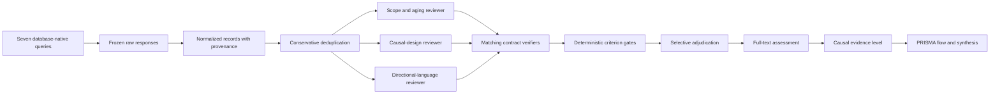

# Causal Multi-omics Aging Review

Reproducible PRISMA-oriented pipeline for identifying empirical multi-omics
studies that investigate aging processes and contain an assessable causal
design or directed causal hypothesis.

The repository is a clean aging-specific rebuild. It reuses only the general
pipeline architecture of
[`BogdanDidenko/text-bio-fundational-models-review`](https://github.com/BogdanDidenko/text-bio-fundational-models-review)
and `BogdanDidenko/causal-multiomics-review`: database-native retrieval,
conservative deduplication, criterion-level LLM screening, deterministic
Python gates, selective adjudication, repeated runs, and an audit trail. It
does not contain the earlier non-aging queries, corpora, benchmarks, prompt
history, or run outputs.

## Review Question

Which empirical studies integrate at least two molecular omics layers to
investigate a process or phenotype of aging, and what causal claim or
identification strategy do they support?

The search does not require the exact phrases `causal inference` or `causal
discovery`. Its causal block includes genetic instruments, mediation,
interventions, perturbations, quasi-experiments, temporal designs, and directed
models. Eligibility is decided from the reported design, not keyword presence.

## Pipeline



## Quick Start

```bash
python -m venv .venv
source .venv/bin/activate
python -m pip install -e '.[dev]'
python scripts/validate_protocol.py
pytest
```

Run a fresh database search. Credentials are read from environment variables
or the existing macOS Keychain entries and are never written to the repository.

```bash
python scripts/search_databases.py \
  --output data/searches/2026-07-27 \
  --sources pubmed,europepmc,scopus,semantic_scholar,springernature,openalex
```

Google Scholar is a documented manual supplementary search because it has no
official API. After freezing the browser export, normalize it and build the
identification snapshot:

```bash
python scripts/import_google_scholar.py \
  --output data/searches/2026-07-27
python scripts/deduplicate.py \
  data/searches/2026-07-27/normalized/all_sources.csv \
  data/normalized/canonical.csv \
  --log data/normalized/deduplication_log.csv
python scripts/summarize_search.py \
  --search-dir data/searches/2026-07-27 \
  --canonical data/normalized/canonical.csv \
  --report docs/search_execution_2026-07-27.md
```

The frozen 2026-07-27 run contains 4,732 source records and 2,852 unique
records after removing 1,880 duplicate instances. See
[`docs/search_execution_2026-07-27.md`](docs/search_execution_2026-07-27.md).

Run title/abstract stability screening with GPT 5.6 Terra Medium through the
locally authenticated Codex CLI:

```bash
python scripts/run_stability.py \
  protocol/screening/benchmarks/title_abstract_calibration_v0.24.0_50.csv \
  data/screening/stability/development-full-50-v0.95.0 \
  --stage title_abstract \
  --parallel-replicates 5
```

The acceptance threshold is 100% exact agreement across five independent runs
for every canonical categorical field, all decisive criteria, and final
routing. `v0.95.0` passed the new 16-record calibration set, the 50-record
development set, and the accessed `v4` and `v5` regression sets with 100%
canonical agreement and no manual reviews. Raw specialist-draft agreement was
81.25%, 94%, 92%, and 92%; verifier field unanimity was 98.47%, 99.82%,
99.82%, and 100%. These diagnostics do not replace the canonical gate. The
separate 25-record `v7` evaluation subsequently failed the strict gate. See
[`docs/prompt_calibration.md`](docs/prompt_calibration.md).

Search retrieval and deduplication are complete. Expert eligibility annotation,
full-text retrieval, and full-text prompt validation remain pending. The frozen
`v0.95.0` candidate was evaluated once on sealed `v7` after commit `6a6f1a7`.
It failed the strict gate: schema and causal-level agreement were `1.00`,
final-route agreement was `0.96`, and decisive and all-tracked agreement were
`0.80`. The candidate is rejected and `v7` is now accessed evaluation data,
not calibration data.

## Canonical Positive

The calibration anchor is
[Multi-omic underpinnings of epigenetic aging and human longevity](https://doi.org/10.1038/s41467-023-37729-w).
Every automated database query must retrieve it where the source indexes the
record.

## License

MIT. See `LICENSE`.
