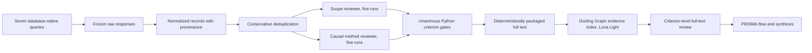

# Causal Multi-omics Aging Review

Reproducible PRISMA-oriented pipeline for identifying empirical multi-omics
studies that investigate aging processes and contain an assessable causal
design or directed causal hypothesis.

The repository is an aging-specific rebuild. It reuses only the general
pipeline architecture of
[`BogdanDidenko/text-bio-fundational-models-review`](https://github.com/BogdanDidenko/text-bio-fundational-models-review)
and `BogdanDidenko/causal-multiomics-review`: database-native retrieval,
conservative deduplication, criterion-level LLM screening, deterministic
Python gates, selective adjudication, repeated runs, and an audit trail. It
keeps rejected prompt and run history segregated as methodological audit
material; it is not part of the active review ledger.

## Review Question

Which empirical studies integrate at least two molecular omics layers to
investigate a process or phenotype of aging, and what causal claim or
identification strategy do they support?

The search does not require the exact phrases `causal inference` or `causal
discovery`. Its causal block includes genetic instruments, mediation,
interventions, perturbations, quasi-experiments, temporal designs, and directed
models. Eligibility is decided from the reported design, not keyword presence.

## Current Status

The final `v1.1.2` search is frozen: 12,528 source records were deduplicated to
7,858 canonical records. The 5,022 records with abstracts were evaluated using
GPT 5.6 Terra Medium, five independent runs per assessed role, and prompt suite
`v1.4.0-rc1`. The suite remains `sealed_holdout_pending_not_active`: it failed
the predeclared 100% five-run stability gate and has not received expert-gold
validation. It is therefore an auditable prioritization instrument, not a
validated screening instrument.

The authoritative path to the current 135-record human title/abstract queue,
the deterministic routing correction, the five-repeat rationale, and all
material that must remain outside the final PRISMA flow are in
[`docs/review_execution_record_2026-08-04.md`](docs/review_execution_record_2026-08-04.md).
The current priority-1 retrieval subflow has 113 reports sought. The original
snapshot archived 98 candidate files, but Docling sufficiency validation found
one Springer HTML access shell without an article body. The corrected active
counts are therefore 97 reports available for full-text assessment and 16 not
retrieved or insufficient; six abstract-only records were removed
before the report-retrieval denominator. Sixteen preprints are outside this
non-preprint batch and are not declared finally excluded. This remains an
interim priority-subset flow, not the final review PRISMA denominator. Its
machine-readable source is
[`prisma_retrieval.json`](data/full_text/v1.1.2_priority_1_nonpreprint_119/prisma_retrieval.json).
The dated correction is documented in
[`full_text_sufficiency_correction_v1.0.0.md`](analysis/docling_graph/full_text_sufficiency_correction_v1.0.0.md).
Docling Graph preprocessing is complete for all 97 sufficient full texts using
GPT 5.6 Luna Light: 97 graphs, 1,475 grounded nodes, zero unresolved nodes, and
zero graph-extraction failures. A 12-report repeat audit produced 12/12 exact
whole-graph SHA-256 agreement. Criterion-level full-text evaluation with GPT
5.6 Terra Medium is also complete for 97/97 reports under suite `v1.0.2` and
five runs per role. The candidate failed its strict stability gate: 3 reports
were unanimously assessed and 94 routed to human review; numeric Level 0-4 was
exact across five runs for 43/97 reports. These are instrument-evaluation
results, not final eligibility or synthesis counts.
See
[`execution_report_v1.0.0.md`](analysis/docling_graph/execution_report_v1.0.0.md)
and the machine-readable
[`prisma_full_text_processing.json`](data/full_text_graph/v1.0.0_luna_light/prisma_full_text_processing.json).
The full-text stability result is documented in
[`execution_report_v1.0.2.md`](analysis/full_text_screening/execution_report_v1.0.2.md).
The rejected `v0.99.0` pilot remains immutable instrument-development history
only; its 790 outcomes and 9,515 raw responses are not part of the v1 ledger or
final PRISMA denominator.

## Pipeline



## Quick Start

```bash
python -m venv .venv
source .venv/bin/activate
python -m pip install -e '.[dev]'
python scripts/validate_protocol.py
python scripts/validate_protocol_v1.py
pytest
```

Run a fresh database search. Credentials are read from environment variables
or the existing macOS Keychain entries and are never written to the repository.

```bash
python scripts/search_databases.py \
  --search-config protocol/search_config_v1.1.2.json \
  --output data/searches/pilots/2026-08-02-v1.1.2 \
  --max-records-per-source 50 \
  --sample-seed 20260802
```

The `v1.1.2` default excludes Springer Nature from identification because the
available Meta API searches a broad full-text index. OpenAlex runs six scoped
query branches, uses exact aging-term matching, and deduplicates their Work IDs
locally. For OpenAlex, the pilot record cap applies separately to each branch.
The fixed sample seed creates a reproducible random branch-quality sample;
omitting `--sample-seed` retains deterministic citation-count ordering.

Google Scholar is a documented manual supplementary search because it has no
official API. After freezing the browser export, normalize it and build the
identification snapshot:

```bash
python scripts/import_google_scholar.py \
  --output data/searches/2026-07-27
python scripts/deduplicate.py \
  data/searches/2026-07-27/normalized/all_sources.csv \
  data/normalized/canonical.csv \
  --log data/normalized/deduplication_log.csv
python scripts/summarize_search.py \
  --search-dir data/searches/2026-07-27 \
  --canonical data/normalized/canonical.csv \
  --report docs/search_execution_2026-07-27.md
```

The frozen 2026-07-27 run is a superseded pilot and is not a final PRISMA
denominator. The v1 count/quality pilot and unresolved gates are documented in
[`docs/search_calibration_v1.0.0.md`](docs/search_calibration_v1.0.0.md).
The current OpenAlex scope ablation and complete retrieval are documented in
[`analysis/openalex_scope_calibration/report.md`](analysis/openalex_scope_calibration/report.md).

After expert-gold development annotation, run the v1 suite with GPT 5.6 Terra
Medium through the locally authenticated Codex CLI:

```bash
python scripts/run_stability.py \
  protocol/screening/benchmarks/v1.0.0/title_abstract_development_80.csv \
  data/screening/stability/v1-development \
  --stage title_abstract \
  --suite-config protocol/screening/configs/prompt_suite_v1.0.0.json \
  --parallel-replicates 5
```

Acceptance requires both 100% five-run agreement on decision-driving fields
and the prespecified expert-gold accuracy thresholds. The v1 protocol and
postmortem are in [`protocol/v1.0.0/prisma_pipeline.md`](protocol/v1.0.0/prisma_pipeline.md)
and [`analysis/v1_methodology/postmortem_v0.99.md`](analysis/v1_methodology/postmortem_v0.99.md).

## Canonical Positive

The calibration anchor is
[Multi-omic underpinnings of epigenetic aging and human longevity](https://doi.org/10.1038/s41467-023-37729-w).
Every automated database query must retrieve it where the source indexes the
record.

## License

MIT. See `LICENSE`.
