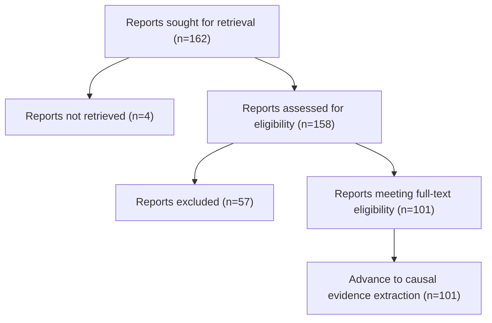

# Frozen full-text PRISMA flow

Status: final for the frozen 162-report full-text candidate cohort.

## Exclusion reasons

| First failed criterion | Reports |
|---|---:|
| EC1 | 26 |
| EC3 | 22 |
| EC4 | 8 |
| EC5 | 1 |

The four reports not retrieved carry internal protocol disposition EC7, but are not counted among reports excluded after full-text assessment. The 101 reports meeting eligibility are candidates for causal evidence extraction, not yet final Level 2-4 synthesis inclusions.

The overall review PRISMA flow remains provisional because upstream title/abstract processing is not fully resolved.
